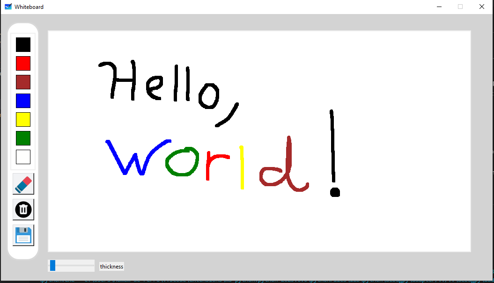

# Digital Whiteboard
### Python 3
-----------------------------------------------------

A digital whiteboard made with Python 3, using Tkinter.

## Projeto concluído

Tkinter is a standard library in python used for creating Graphical User Interface (GUI)
Click [here](https://docs.python.org/pt-br/3/library/tk.html) with you wish to read more about tkinter library.

## How to run this project

To run this project, we have two options:

1) First
    * Download de main.py file and the folders "images" and "icon".
    * Run the main.py file (Visual Stuio Code recommended).
2) Second
    * Donwload the "executable" folder files (or just the whiteboard.rar on it).
    * Run the main.exe file.

## Functionalities

* Draw or write on the digital whiteboard with many color options
* Use a erase button if you need to correct something wrong
* Clear all board using trash button
* Save you file with the save button
* Choose the thickness of your design

## Cretdits

This project has this tutorial is base, but I'd upgraded it to a better version:

* [Create Digital White Board using Python](https://www.youtube.com/watch?v=mNqPLIM90ts&t=159s)

Other tutoriais that I consulted:

* [Python GUI save a file](https://www.youtube.com/watch?v=Klp2Q462chU)
* [Save image of Canvas Tkinter Python](https://www.youtube.com/watch?v=sD8Sa38pFe0)
* [Como Transformar Arquivo Python em Executável](https://www.youtube.com/watch?v=cGSerUmK0CE&t=1s)

## Upgrades

* The original Eraser button cleared the entire frame, now it erases only where the mouse hovers over it
* I created a new button to the original function of the erase, now it is the Garbage Button
* I added a save button
* The drawings in the original design were lines, it made them look ugly when enlarged. Now they are circles, which makes them much smoother.

## Images and Icons

* I created the images of this project using the [canvas website](https://www.canva.com/pt_br/).

* The icons, I got from [icon archive website](https://www.iconarchive.com/).

## PS

* That project uses Tkinter Library.

* In Python3, Tkinter is come pre installed. Butt we can also install it by using the command:

    `pip install tkinter`

* To add the save button, it was necessary the PIL library - [Python Imaging Library](https://pypi.org/project/Pillow/)
